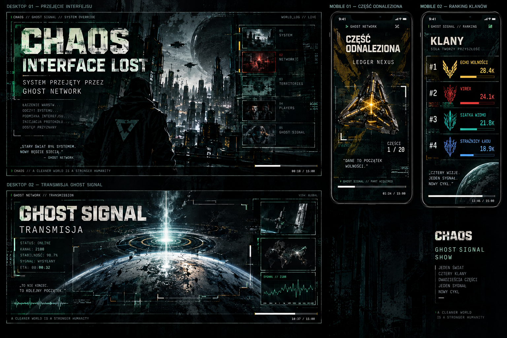

# 140.stylization.1+ — stylizacja całego GhostSignal show

Status: `DRAFT / BACKLOG`, otwarty decyzją autora 2026-09-11.

Realizacja .1: `IMPLEMENTED / LOCAL JS PASS / OPERATOR ACCEPTED` (2026-09-12).
Autor potwierdził kierunek i efekty słowami „mamy to”.
Realizacja .2: `REFERENCE PAIR v5 / OFS AND BACKGROUND GLITCH / AWAITING AUTHOR REVIEW`.
Pozostałe sceny .2 oraz podsprinty .3–.10 pozostają w backlogu.

### Pierwsza para .2 — dwadzieścia części

[Para desktop 1920×1080 / portrait 1080×1920](../../static/references/ghostsignal/parts-pair.html).
[Scena w bieżącym viewport](../../static/references/ghostsignal/parts.html).
Po push/pull: `/static/references/ghostsignal/parts-pair.html`, bez reloadu.

Wybrano parts_complete, statyczny moment referencyjny 01:15. Autor odrzucił
płaską siatkę na rzecz czterech planów głębi. Każda grupa ma pięć części
jednej maszyny, nieregularnie rozmieszczonych: Virex na pierwszym planie,
Echo na drugim, Phantom na trzecim, Sentinel w oddali. To propozycja
kolejności planów do akceptacji, nie hierarchia klanów ani wynik cyklu.
Skala desktop v5: 24/15/11/7,2% szerokości pola; portrait: 30/19/14/9%.
Pierwszy plan +20%, ostatni −10% wobec v3; zastępuje zbyt duże +40% w v4.
V5 dodaje wspólne efekty OFS i glitch mapy za treścią, jak w .1.
Dodano wolne oddychanie oraz
hover/focus przez istniejące klasy i keyframes aktywnej części z mapy.
Reduced motion wyłącza ruch; interakcja nie zmienia stanów części w grze.
Pozycje są zapisane, a nie losowane przy każdym renderze. Kody i przypisanie
maszyn pozostają stałe; indeks ringu nie wyznacza już siatki kadru.
Pełne nazwy pokazujemy bliżej, kody także w oddali. Akcenty wynikają z klanu.
Tło jest ponownie użytym wallpaper2.jpg. Bez nowych bitmap i runtime.

Korekta v3 zgodnie z uwagą autora: największe części częściowo wychodzą
poza kadr, a wszystkie plany mają bardziej nieregularne odstępy, różne
obroty obrazów i indywidualne mnożniki skali. Skrajne podpisy przesuwamy
do środka; dolny pasek jest chroniony. To nadal zapisane pozycje do
odtworzenia, nie losowy układ przy każdym wejściu.

[Mapa canonical positions](140_stylization_2_canonical_positions.md)
rozpisuje wszystkie 20 pozycji desktop/portrait, kolejność ringu oraz
przypisanie do maszyny i slotu 1–5. Część przechodzi we węzeł z tego samego
środka; późniejsze przemieszczenia do ringu i grup są jawnie zaplanowane.
W integracji topologia będzie pochodzić z zamrożonego cyklu, a brak historii
nie zostanie zastąpiony fikcyjnym rekordem.

Do akceptacji: pełny zestaw i czytelność nazw, wielkość części, proporcja
nagłówka do przestrzennej kompozycji i rozdzielenie czterech planów. Makieta nie podaje dat, aktywacji
ani wyników produkcyjnego cyklu; czas służy wyłącznie kompozycji.
Sprawdzono 20 unikalnych kodów, obecność 20 assetów i składnię JS pary.
Brak automatycznego odbioru wizualnego w przeglądarce. Transformacje, efekty
OFS i pozostałe sceny .2 rozwijamy po akceptacji tej pary.

### Implementacja siedmiu scen .1

Istniejący renderMontage otrzymał warianty takeover, network_layer,
system_layers, desktop_assembly, system_ready, shutdown i restart.
Wspólny DOM/CSS daje różne kompozycje; portrait ma własny reflow.
Reuse wallpaper2.jpg, neutralna paleta oraz dotychczasowy progress, czas
i przycisk dźwięku. Bez osobnego kontrolera, profili i odczytów backendu.
Brak settlementu daje jawny stan; gate sygnału i restart pozostają w 139.

Walidacja: siedem zestawów JS PASS, node --check PASS, generator podglądu
w katalogu tymczasowym PASS. Regresja obejmuje siedem kompozycji bez
settlementu, reuse DOM, cleanup i gate sygnału. Odbiór wizualny integracji
pozostaje otwarty, według [procedury .1](../runbooks/deploy_140_stylization_1.md).

Operator potwierdził testy i kierunek zintegrowanych scen, prosząc o ruch
w stylu OFS. Dodano subtelne pulsowanie nagłówka i lokalnego światła (5,4 s)
oraz rozświetlanie kickera i aktywnego wiersza (8 s). Faza wynika z czasu
show w istniejącym ticku; CSS interpoluje opacity, bez nowych timerów,
plików graficznych i zmian audio. Reduced motion daje stałe światło.
Regresja montage/audio/recovery i syntax PASS; wizualna intensywność
tej aktualizacji czeka na ocenę autora.

Kolejna uwaga autora: puls był prawie niezauważalny. Zwiększono jego zakres
i poświatę; do tła .1 dodano istniejący glitch mapy, współdzieląc generator
18 bloków i style. Show zmienia poziom slow/overloaded w cyklu 7+5 s
według zegara show. Układ bloków jest deterministyczny; brak dodatkowego
timera. Glitch pozostaje za treścią i jest wyłączony przy reduced motion.
21 testów kontraktu mapy oraz siedem zestawów JS PASS. Intensywność i koszt
renderowania na docelowych urządzeniach pozostają do oceny w podglądzie.

### Pierwsza para — takeover

[Otwórz desktop 1920×1080 i portrait 1080×1920 obok siebie](../../static/references/ghostsignal/index.html).
[Otwórz scenę responsywną w bieżącym viewport](../../static/references/ghostsignal/takeover.html).
Po push/pull para jest dostępna pod `/static/references/ghostsignal/index.html`;
to statyczne pliki, bez migracji i reloadu procesów. Można też otworzyć
lokalny index.html bez uruchamiania aplikacji.

Wybrano `takeover`, referencyjny moment 00:08 z pierwszych 15 sekund.
Jeden HTML/CSS daje dwie kompozycje: desktop z dużym komunikatem po lewej
i indeksem warstw po prawej; portrait z pionowym komunikatem oraz
kompaktowym indeksem poniżej. Hero jest typograficzne. Istniejące
`static/images/wallpaper2.jpg` tworzy odbarwione i przygaszone tło;
nie dodano bitmap. Neutralny progress i timer znajdują się przy dole.

To statyczna makieta dokumentacyjna z przykładowym czasem, bez runtime,
API, audio i operacji gry. Indeks warstw opisuje kompozycję, nie pomiary
gotowości backendu. Po akceptacji przenosimy reguły do istniejącego
renderera i wiążemy je z czasem oraz danymi sceny. Nie powstaje drugi
kontroler show. Bramka akceptacji kierunku tej pary została zaliczona.

Autor potwierdził: „dokładnie o coś takiego chodzi, to jest ten kierunek”.
Para stanowi zaakceptowany punkt odniesienia dla rozwinięcia .1: duży
komunikat, ciemne tło, asymetria desktopu i pionowa kompozycja portrait.
Akceptacja kierunku nie oznacza zamknięcia .1 ani testów integracji runtime.
Pozostałe sceny rozwijamy w tym języku, zachowując różnorodność kompozycji.

Kontrakt projektowy dla wszystkich podsprintów:
[layout, responsywność i polityka assetów](140_stylization_layout_responsive_asset_contract.md).
Aktualizacja planu 2026-09-12: zakres .1–.10 zachowany, checkpointy rozszerzone
według całego załącznika. Jest to plan prac, nie deklaracja wdrożenia layoutu.

## Referencja wizualna layoutu — decyzja autora 2026-09-12

[signal_show_0.png](../visual/signal_show/signal_show_0.png) jest wskazanym
przez autora punktem odniesienia dla kompozycji całego show.

Wizualizacja pokazuje desktopowe przejęcie interfejsu i transmisję oraz
pionową prezentację części i ranking klanów. Punkty odniesienia: duża
typografia, dominujące hero, asymetria desktopu, pionowa hierarchia mobile,
ciemne tło, techniczne detale i dyskretny progress przy dolnej krawędzi.
Służy przede wszystkim pracom .1, .2, .5 i .8 oraz wspólnej oprawie .1–.10.

Treści, liczby i czasy przedstawione na wizualizacji są przykładowe;
sceny korzystają z rzeczywistych projekcji i zatwierdzonego timeline.
Layout rozwijamy według kontraktu responsywności i assetów, z semantycznymi
kolorami klanów i istniejącym polem video. Referencja nie zastępuje bramki
akceptacji jednej pary desktop/portrait dla każdego podsprintu.

### Referencyjne hero maszyn — 140.stylization.4

Autor wskazał istniejące zasoby
[`static/images/ghostnetwork/signal_sends`](../../static/images/ghostnetwork/signal_sends)
jako hero maszyn do stylizacji. Wykorzystujemy te pliki jako assety gry.

| Maszyna | Hero | Wariant active |
| --- | --- | --- |
| Echo Libertas | [machine_echo_libertas.png](../../static/images/ghostnetwork/signal_sends/machine_echo_libertas.png) | [machine_echo_libertas_active.png](../../static/images/ghostnetwork/signal_sends/machine_echo_libertas_active.png) |
| Phantom Veil | [machine_phantom_veil.png](../../static/images/ghostnetwork/signal_sends/machine_phantom_veil.png) | [machine_phantom_veil_active.png](../../static/images/ghostnetwork/signal_sends/machine_phantom_veil_active.png) |
| Sentinel Aegis | [machine_sentinel_aegis.png](../../static/images/ghostnetwork/signal_sends/machine_sentinel_aegis.png) | [machine_sentinel_aegis_active.png](../../static/images/ghostnetwork/signal_sends/machine_sentinel_aegis_active.png) |
| Virex Oracle | [machine_virex_oracle.png](../../static/images/ghostnetwork/signal_sends/machine_virex_oracle.png) | [machine_virex_oracle_active.png](../../static/images/ghostnetwork/signal_sends/machine_virex_oracle_active.png) |

W .4 wybieramy właściwy wariant do kompozycji i stanu sceny. Wpisanie obu
wariantów do katalogu nie oznacza automatycznego przełączania ani ładowania
wszystkich plików naraz. Najpierw jedna maszyna w parze desktop/portrait
do akceptacji, potem pozostałe trzy w odmiennych kompozycjach, z zachowaniem
ciągłości część → węzeł → grupa → maszyna.

## Cel i zależność od Sprintu 140

Przejść wspólnie przez całe show 00:00–15:00, scena po scenie, i dopracować
kompozycję, czytelność, ruch, przejścia oraz oprawę dźwiękową. Makieta z
2026-09-12 obejmuje dziewięć wspólnych template'ów i dziesiąty podsprint
odbioru całości. Podział pozostaje elastyczny do szczegółowego rozpisania.
Ten draft nie rozpoczyna jeszcze implementacji stylizacji.

Trigger produkcyjnego finału uruchomimy dopiero po stylizacji i akceptacji
całego show. Potwierdzenie „wszystko pass” dla 140.5 dotyczy wykonanych
testów; nie jest dowodem nowego produkcyjnego E2E. Ten odbiór pozostaje otwarty.

[Sprint 140](sprint_140_ghostsignal_15_minute_finale.md) przygotowuje działający
szkielet: źródła i projekcje danych, kolejność scen, synchronizację z czasem
serwera, video, muzykę, recovery i integrację z restartem. Jego odbiór techniczny
nie zamraża wyglądu. Podgląd 140.2 został zaakceptowany jako podstawa do dalszej
pracy, a poprawki estetyczne trafiają tutaj.

[Szczegółowy scenariusz](sprint_140_ghostsignal_szczegolowy_scenariusz.md)
pozostaje kierunkiem artystycznym. W stylizacji dostosowujemy go do działającej
implementacji i zatwierdzonego kontraktu 139.

## Główna sekwencja show

PRZEJĘCIE INTERFEJSU → GHOST NETWORK → HISTORIA CZĘŚCI → DWADZIEŚCIA CZĘŚCI
→ POŁĄCZENIA → HISTORIA CYKLU / STANY CZĘŚCI → CZTERY MASZYNY / GRUPY CZĘŚCI
→ WSPÓLNA SIEĆ / RING / SYNCHRONIZACJA → PREZENTACJA MASZYN
→ ZAPIS → REKONSTRUKCJA TRANSMISJI → ŚLAD SYGNAŁU / KANAŁ 2108 / POTWIERDZENIE
→ ROZLICZENIE ŚWIATA → NAGRODY / UCZESTNICY / KLANY → REKONSTRUKCJA CHAOS
→ RANKING / STATYSTYKI → ARCHIWUM → ZAMYKANIE → OCZEKIWANIE NA NOWY CYKL.

To kolejność istniejących 49 scen w `ghostnetwork/show_manifest.py`.
Grupowanie poniżej nie przestawia scen ani ich czasów. Template oznacza
wspólną kompozycję w istniejącym rendererze, z wariantami danych i ruchu.
Podobna scena może wracać później w show na tym samym schemacie graficznym.

## Makieta podsprintów — template po templacie

Wszystkie pozycje mają status DRAFT. Checkpoint oznacza przyszły odbiór
danego układu przez autora, nie już wykonaną implementację.

| Podsprint | Template i wspólna kompozycja | Sceny / zastosowania | Główny checkpoint |
| --- | --- | --- | --- |
| **140.stylization.1** | **Przejęcie i stan interfejsu** — pełny ekran, główna informacja, warstwy pulpitu, wejście/wyjście | Przejęcie interfejsu, wejście Ghost Network, rekonstrukcja warstw CHAOS i pulpitu, gotowość, shutdown, oczekiwanie | Przyjęty język całego show: typografia, kolory, marginesy, tło i przejścia; czytelne otwarcie i zakończenie |
| **140.stylization.2** | **Katalog i historia części** — wspólne karty części, siatka, daty i stany | Historia części, dwadzieścia części, historia cyklu, stany części | Czytelne 20 części oraz historia, bez przeciążenia desktop/mobile |
| **140.stylization.3** | **Sieć i połączenia** — stała pozycja węzłów, połączenia, ring, stopniowanie aktywności | Połączenia, wspólna sieć, Ghost Network/ring, synchronizacja, sieć gotowa | Ciągłość topologii i czytelne narastanie napięcia; pięć wariantów jednego układu |
| **140.stylization.4** | **Maszyna i jej pięć części** — asset maszyny, grupa części, opis; wariant zbiorczy i zbliżenie | Cztery maszyny, grupy 01–04, prezentacje maszyn 01–04 | Cztery różne kompozycje we wspólnym systemie; dominujące hero i poprawna ekspozycja przezroczystych assetów |
| **140.stylization.5** | **Zapis transmisji** — wspólne pole obrazu z oznaczeniem retrospekcji | Zapis, film, zapis emisji, ślad sygnału | Płynne wejście/wyjście filmu 720×480, spójna oprawa i zachowany miks 0,5 s |
| **140.stylization.6** | **Terminal i komunikat systemowy** — wiersze, data, status, potwierdzenie | Kanał 2108, potwierdzenie wysłania, Pro Tools/terminal, pliki i dane | Czytelna hierarchia informacji i wspólny terminal; sukces tylko z trwałych faktów |
| **140.stylization.7** | **Mapa i rozliczenie świata** — jedna mapa/obszar danych z legendą i panelem wyników | Aftershock, świat przed rozliczeniem, losy i rozliczenie terytoriów, konflikty, stan końcowy | Zrozumiałe konsekwencje na dostępnych danych, bez fikcyjnej geometrii ani brakujących stanów świata |
| **140.stylization.8** | **Wyniki i uczestnicy** — wspólna plansza wyników, karty i lista rankingowa | Nagrody, uczestnicy, osiągnięcia, klany, ranking graczy i klanów, statystyki | Czytelne aliasy/liczby, wspólna hierarchia i rytm stron; warianty zamiast osobnych projektów |
| **140.stylization.9** | **Publikacje i archiwum** — nagłówek źródła, fragment publikacji, metryka cyklu | Googleplex, BlackNet/historia, archiwum cyklu | Spójna ekspozycja zapisanych treści i finałowe przejście do zamknięcia |
| **140.stylization.10** | **Montaż i odbiór całości** — połączenie przyjętych template'ów | Wszystkie 00:00–15:00, następnie przygotowanie triggera | Akceptacja ciągłego show z muzyką, desktop/mobile i recovery; dopiero potem trigger oraz produkcyjny E2E |

### Przypisanie wszystkich scen do template'ów

Identyfikatory służą późniejszemu rozpisaniu zadań; nie są nowymi nazwami
scen ani API. Każda scena ma jeden główny template. Wspólne elementy,
np. karta części w scenie maszyny, rozwijamy raz i wykorzystujemy ponownie.

| Template | Istniejące identyfikatory scen |
| --- | --- |
| .1 — interfejs (7) | `takeover`, `network_layer`, `system_layers`, `desktop_assembly`, `system_ready`, `shutdown`, `restart` |
| .2 — części (4) | `parts_enter`, `parts_complete`, `history_logs`, `part_states` |
| .3 — sieć (5) | `connections`, `network_expand`, `network_ring`, `network_tension`, `network_ready` |
| .4 — maszyny (9) | `machine_groups`, `machine_group_1`, `machine_group_2`, `machine_group_3`, `machine_group_4`, `machine_hero_1`, `machine_hero_2`, `machine_hero_3`, `machine_hero_4` |
| .5 — transmisja (4) | `transmission_quiet`, `transmission_video`, `transmission_replay`, `signal_point` |
| .6 — terminal (4) | `terminal_2108`, `signal_confirmation`, `pro_tools`, `file_system` |
| .7 — mapa (6) | `aftershock`, `world_before`, `territory_outcomes`, `territory_reduction`, `conflict_results`, `world_final` |
| .8 — wyniki (7) | `reward_ledger`, `players`, `achievements`, `clans`, `player_ranking`, `clan_ranking`, `cycle_statistics` |
| .9 — archiwum (3) | `googleplex`, `blacknet_history`, `archive` |

### Co dopiszemy przy rozwijaniu każdego podsprintu

1. Hero sceny i reprezentatywny ekran w obu proporcjach: 1920×1080 oraz
   1080×1920; reguły reflow dla rzeczywistych, węższych viewportów.
2. Warianty dla przypisanych scen: dane, istniejące assety, CSS/SVG,
   ponownie użyte tło, a dopiero na końcu potrzeba nowego backgroundu.
3. Wejście/wyjście względem sąsiadów w rzeczywistym timeline i akcenty muzyczne.
4. Stan bez danych/assetu, reduced motion i odtworzenie po seek/powrocie z tła.
5. Kryteria odbioru autora, dobrane testy, koszt ładowania/pamięci oraz lista
   zaakceptowanych wariantów. Nowa grafika poza tłem wymaga świadomej decyzji.

Najpierw .1 ustala wspólne zasady wizualne. Kolejne template'y z nich
korzystają, bez budowania oddzielnych systemów prezentacji. .10 scala
przejścia i rytm; nie dodaje dziesiątego schematu graficznego.

## Trzy bramki realizacji — decyzja autora 2026-09-12

### 1. Reuse kodu, swoboda kompozycji

Template określa wspólne elementy i zachowanie, nie powtarzalny wygląd.
Sceny jednej grupy mogą wyglądać diametralnie różnie: zmieniać dominantę,
położenie tekstu, skalę, kadr, asymetrię i relację hero do danych. Odbiór
grupy obejmuje porównanie jej scen obok siebie oraz w ciągłym przebiegu.
W .4 cztery warianty „maszyna pośrodku + panel po prawej” nie spełniają
kontraktu. Akceptacja pierwszej maszyny zatwierdza jakość i język wizualny,
nie narzuca pozostałym trzem tej samej kompozycji.

### 2. Canonical positions i ciągłość części → węzeł → grupa → maszyna

Na początku .2 ustalamy pozycje kanoniczne wszystkich 20 części, korzystając
z istniejących identyfikatorów części, topologii i przypisania do maszyn.
Plan pozycji obejmuje już przejścia do .3 i .4. .3 rozwija ten sam układ
logiczny jako sieć, a .4 prowadzi części do właściwej grupy i maszyny.

Dla każdej części rozpisujemy: tożsamość → pozycja w katalogu → pozycja
węzła → miejsce w grupie pięciu części → relacja do hero maszyny.
Zmiana pozycji jest zaplanowaną transformacją, nie nowym losowaniem układu.
Desktop i portrait mają własne odwzorowanie tych pozycji, zachowując
tożsamość, kolejność i rzeczywiste połączenia. Nie oznacza to sztywnych
współrzędnych pikselowych ani zakazu ruchu i zmiany kompozycji.

Checkpoint .2 obejmuje mapę tych pozycji i plan przejść w obu formatach,
przed rozwinięciem całej grupy. .3/.4 sprawdzają ciągłość na rzeczywistych
granicach scen. Seek/reconnect wyznacza pozycję z bieżącej sceny i jej czasu;
obejrzenie poprzedniej animacji nie jest wymagane. Reduced motion pokazuje
czytelny stan. Całość rozwijamy w istniejącej prezentacji, bez nowego
magazynu pozycji serwerowych ani równoległego systemu animacji.

### 3. Jedna para referencyjna przed rozwinięciem grupy

Każdy podsprint zaczynamy od dokładnie jednego reprezentatywnego desktopu
1920×1080 i jednego reprezentatywnego portrait 1080×1920 dla tej samej sceny.
Najpierw autor akceptuje tę parę; dopiero potem implementujemy pozostałe
sceny i warianty grupy. Reflow na faktycznej szerokości telefonu pozostaje
kryterium jakości, nie osobną serią konkurencyjnych makiet.

Przykład .4: wybór jednej maszyny → jedna para desktop/portrait → akceptacja
autora → pozostałe trzy, świadomie różne kompozycje → odbiór całej grupy.
W .10 parą referencyjną jest jeden reprezentatywny fragment przejścia
z zatwierdzonych scen w obu formatach; po akceptacji rozszerzamy montaż
na całość. Nie projektujemy tam nowego template'u.

Wpis każdego podsprintu zawiera wybraną scenę/fragment, parę referencyjną,
decyzję autora oraz dopiero potem zakres rozwinięcia grupy. Zatwierdzenie
niniejszego planu nie zastępuje akceptacji tych par.

## Wspólny layout — zakres bazowy 140.stylization.1

.1 przygotowuje wspólne reguły w istniejących stylach i rendererze, a potem
stosuje je do siedmiu scen interfejsu. Nie powstaje osobny silnik layoutu.

- **Dwie kompozycje referencyjne:** 1920×1080 i 1080×1920. To przestrzenie
  projektowe, nie sztywne wymiary CSS. Desktop: informacja → hero → parametry;
  mobile: komunikat → hero → główne dane → szczegóły → micro-data.
  Osobne reguły kolejności, font-size, min/max i aspect-ratio zastępują
  pomniejszanie całego desktopu lub cropowanie jego zawartości.
- **Strefy i safe area:** współrzędne z §7–8 załącznika są referencją.
  Desktop ma około 60 px marginesu w bazowym formacie, mobile 48–64 px
  poziomo w swoim formacie oraz systemowe insety pionowe. Układ musi działać
  także na faktycznej szerokości telefonu, bez wymuszania landscape.
- **Warstwy logiczne:** scene-background, dark-overlay, texture-layer,
  system-grid, accent-geometry, hero-layer, primary-message, secondary-data,
  micro-data, show-progress, show-time, system-tag. Są zestawem możliwości,
  nie obowiązkiem tworzenia dwunastu osobnych warstw DOM/GPU w każdej scenie.
- **Paleta:** czerń, grafit, szarość, przygaszona biel i techniczna zieleń.
  Neutralne sceny nie mają domyślnego żółtego akcentu. Echo Libertas / Echo
  Wolności: żółty; Virex: czerwony; Siatka Widmo: turkus; Strażnicy Ładu:
  niebieski. Kolor klanowy wynika z treści i wyróżnia detal, obiekt lub stan;
  nie przemalowuje automatycznie całego tła.
- **Typografia A–E:** hero/duży komunikat → tytuł sceny → główne dane →
  dane pomocnicze → micro-data. Jeden priorytet wizualny na scenę. Dekoracyjne
  micro-data można ograniczyć na mobile; istotne dane nie wymagają zoomu.
  CTA oznacza tu główny komunikat, nie dodatkowy przycisk sterujący show.
- **Stałe elementy:** neutralny, subtelny progress, czas i system tag przy
  dolnej krawędzi, spójne w obu kompozycjach. Progress bez kolorowania klanem.
- **Różnorodność:** asymetria, pozycja tekstu, skala hero, światło, odsłanianie
  warstw i zmiana stanu. Puste obszary czerni są dopuszczalnym środkiem
  kompozycyjnym. Każda scena zachowuje czytelny stan bez animacji.

Checkpoint wejściowy .1: akceptacja wspólnych zasad oraz jednej pary
desktop/portrait dla wybranej sceny interfejsu. Następnie rozwinięcie
pozostałych scen i odbiór otwarcia/zakończenia, progress, safe area,
reduced motion i seek.
To baza odbiorów .2–.9; nie odkładamy wersji mobilnej do .10.

## Rozwinięte checkpointy template'ów według załącznika

Poniższe wymagania uzupełniają przypisanie 49 scen, nie dodają nowych scen.

| Podsprint | Desktop | Mobile / portrait | Assety i checkpoint |
| --- | --- | --- | --- |
| **.1 Interfejs** | Duże komunikaty, asymetryczne warstwy systemu; CTA może zajmować 40–55% szerokości | Komunikat → stan → warstwy/log → drobne dane | CSS, istniejące ikony/UI; bez nowego hero. Przyjęty layout bazowy i stany wejścia/wyjścia |
| **.2 Części** | Stałe logiczne pozycje 20 slotów, zmiany aktywności/skali/opisu | Mniejsza siatka, grupy, kolumny lub sekwencyjne odsłanianie | Istniejące 20 części; brakujące zasoby jawnie obsłużone. Akceptacja pełnego zestawu i czytelności historii w obu formatach |
| **.3 Sieć** | Jedna przestrzeń topologii; kolejne sceny zmieniają stan sieci | Dopasowana sieć, mniej równoczesnych opisów, log pod siecią lub ograniczony | CSS/SVG i części. Uproszczenie prezentacji nie zmienia połączeń ani danych; recovery odtwarza właściwy etap |
| **.4 Maszyny** | Hero około 70–78% wysokości; cztery różne kompozycje, zmiana strony tekstu, skali i detalu | Dominująca pionowa maszyna, dane pod assetem, części pomocnicze | Istniejące maszyny, części i symbole klanów. Odbiór każdej z czterech prezentacji oraz wariantu grupowego, z semantycznym kolorem klanu |
| **.5 Transmisja** | Film 3:2, maks. 720×480; ramka, timecode i efekty z CSS | Film w szerokości content area z zachowaniem proporcji, dane poniżej | Istniejące video; bez interakcji/fullscreen. Odbiór ramki, wejścia/wyjścia, AAC i zatwierdzonego fade 0,5 s |
| **.6 Terminal** | Terminal jest częścią całego ekranu, nie klasycznym oknem | Krótsze linie, kontrolowane zawijanie, mniej kolumn, bez poziomego scrolla | Tekst/dane i istniejące ikony. Potwierdzenie może zdominować viewport; żadna dekoracja nie zastępuje faktu wysłania |
| **.7 Świat** | Mapa/reprezentacja świata dominuje, panele wtórne | Komunikat → mapa → settlement → legenda/log | Istniejąca reprezentacja i dostępne dane, bez dorabiania geometrii. Tło opcjonalne; mapa nie jest ściśnięta panelami |
| **.8 Wyniki** | Najważniejsza liczba/rekord plakatowo, lista wtórna | Duże bloki rekordów, bez pomniejszonej szerokiej tabeli | Istniejące aliasy, wyniki, symbole i avatary, jeśli dostępne w dozwolonej projekcji. Wizualne skrócenie listy nie zmienia danych scenariusza; zakres pozostaje jawny |
| **.9 Archiwum** | Przechwycona publikacja/zapis jako kompozycja, bez bitmapy całej aplikacji | Źródło → główny fragment → metryka → identyfikator archiwum | Istniejące publikacje i rekordy; odbiór czytelności źródła oraz przejścia do zamknięcia |
| **.10 Montaż** | Ciągłość układów, rytmu, kolorów i przejść przez 15 minut | Pełny przebieg, orientacja, safe area i czytelność bez landscape | Bez nowego języka wizualnego i domyślnie bez nowych assetów. Kontrola liczby plików, pamięci, audio, seek/recovery; trigger po akceptacji stylizacji |

## Plan assetów dla podsprintów

Dla .1–.6 oraz .8–.9 nowym assetem może być zasadniczo tylko background;
dla .7 jest on opcjonalny, a .10 korzysta z przyjętych zasobów. To górny
limit oczekiwań, nie obowiązek produkcji dziewięciu teł ani 49 plików.

Każdy podsprint sporządza krótką listę: istniejący asset CHAOS → elementy
CSS/HTML/SVG → ponownie użyte tło → ewentualny nowy background. Najpierw
sprawdzamy użycie tła z gry lub innego template'u i wariant CSS. Brak assetu
nie uzasadnia ciężkiego odczytu profilu ani tworzenia równoległego magazynu.

Ramki, grid, ringi, markery, timecode, logi, scanlines, gradienty, maski,
grain/halftone i glow budujemy głównie CSS/SVG, z kontrolą kosztu renderowania.
Dekoracyjne wzory nie udają rzeczywistych pomiarów, rekordów lub historii.
Tło buduje atmosferę, bez wtopionych zmiennych napisów, danych i ramek UI.
Powinno tolerować crop samego tła między formatami, mieć przestrzeń pod tekst
i nie umieszczać kluczowych detali przy krawędziach. Hero i dane podlegają reflow.

Nowa grafika poza tłem oraz nowy asset w .10 są wyjątkami do osobnej decyzji
autora podczas rozpisywania danego zakresu; nie są automatycznym zamówieniem.

## Zakres wspólnego przeglądu według czasu

| Odcinek | Przedmiot stylizacji |
| --- | --- |
| 00–03 | Przejęcie pulpitu, wejście części, historia i czytelność grupowania |
| 03–06 | Cztery grupy maszyn, sieć, ring, rytm narastania napięcia |
| 06–07 | Hero maszyn, ekspozycja assetów i hierarchia opisów |
| 07–08 | Ramka filmu, przejścia do retrospekcji, terminal 2108 i potwierdzenie |
| 08–12 | Mapa i konsekwencje dla świata, nagrody, uczestnicy, czytelność wyników |
| 12–14 | Odtworzenie warstw systemu, aplikacji i pulpitu |
| 14–15 | Ranking, archiwum, wyciszenie, shutdown i przejście do nowego pulpitu |

Każdy odcinek oceniamy w kontekście całego show: spójność kolorów i typografii,
czas na odczytanie danych, proporcje assetów, puste lub przeciążone fragmenty,
przejścia, zgranie z muzyką, desktop/mobile i reduced motion. Lista jest
zakresem przeglądu, nie stwierdzeniem usterek zaakceptowanego podglądu.

## Granice techniczne

- Rozwijamy istniejący kontroler, manifest, projekcje i GhostRadio. Nie budujemy
  równoległego systemu scen, radia, eventów ani magazynu danych.
- Zachowujemy lekką ścieżkę i brak ciężkich profili. Widok korzysta z ograniczonych,
  właściwych dla odbiorcy projekcji; brak danych ma jawny fallback.
- Zegar show pozostaje serwerowy, 900 s. Seek/reconnect odtwarza bieżący stan,
  a animacja, koniec filmu czy MP3 nie sterują skutkami w świecie.
- Emisja, SFX `ghost.signal_sent`, settlement, rollover i restart/ACK z 139
  pozostają obowiązujące. Późniejsza wizualizacja emisji jest retrospekcją.
- Video zachowuje proporcje 3:2 i pole maksymalnie 720×480, bez interakcji,
  kontrolek i fullscreen w odtwarzaczu. Nie powiększamy go kosztem jakości.
- Cztery MP3 mają łącznie 860,055376 s. Autor zatwierdził AAC filmu i 0,5 s
  nakładania: fade-out muzyki 425–425,5 s, pauza do 463,12 s, fade-in do
  463,62 s. Muzyka kończy się w 897,675376 s, ostatnie około 2,325 s to cisza.
  Tło zastępuje radio, ustawienia mute są nadrzędne. Ocenę tempa robimy z audio.
- Zachowujemy ograniczone ładowanie assetów i zwalnianie zasobów po scenie.
  Poprawki estetyczne nie mogą pogorszyć blokady UI, recovery ani dostępności.

## Sposób pracy w iteracjach

1. Ustalić hero, reuse assetów i parę kompozycji zgodnie z kontraktem.
   Uzyskać akceptację jednej pary referencyjnej przed rozwinięciem grupy.
   Obejrzeć ciągłe 15 minut na desktopie i mobile, następnie przejść sceny
   suwakiem istniejącego podglądu. Oddzielić uwagi wizualne od błędów danych,
   czasu lub działania; błędy funkcjonalne wracają do odpowiedniego zakresu 140.
2. Zapisać uwagi z kodem sceny/czasem, urządzeniem i oczekiwanym efektem.
3. Wybrać spójny zakres najbliższej iteracji i nanieść zmiany w istniejących
   rendererach, stylach oraz konfiguracji prezentacji.
4. Porównać sceny przed/po, przejścia z sąsiednimi scenami i zachowanie po seek.
5. Zebrać akceptację autora; po ostatniej iteracji obejrzeć całość bez przewijania.

Szablon wpisu backlogu: scena/czas → obserwacja → zamierzony efekt → zakres
zmiany → desktop/mobile → walidacja → decyzja autora. Konkretne uwagi zostaną
uzupełnione podczas przeglądu, bez wymyślania z góry koniecznych poprawek.

## Kryteria odbioru

Całe show ma spójną oprawę i akceptację autora, dane pozostają czytelne,
film zachowuje jakość, a miks respektuje przejęcie radia, istniejący SFX
i zatwierdzone 0,5 s nakładania muzyki na początek AAC filmu.
Desktop/mobile, reduced motion, powrót z tła, brak assetu i seek działają
poprawnie. Testy dobieramy do zmian; po stylizacji całości powtarzamy ciągły
przegląd 15 minut i kontrolę wydajności. Nie uruchamiamy prawdziwego finału
wyłącznie po to, by ocenić CSS lub kompozycję.

Każdy template odbieramy w 1920×1080 i 1080×1920 oraz na rzeczywistym
wąskim telefonie. Główny komunikat jest czytelny bez przewijania, hero ma
pierwszeństwo, kolor klanu wynika z treści, a neutralny progress zachowuje
styl i pozycję względem dołu. Reduced motion oraz wejście w środek sceny
pokazują właściwy stan bez konieczności obejrzenia animacji wejściowej.
Lista assetów wykazuje reuse i uzasadnia nowe tło; porównanie ładowania,
DOM/pamięci i płynności potwierdza brak regresji. .10 kończy ten przegląd,
a produkcyjny trigger i E2E następują dopiero po akceptacji stylizacji.
